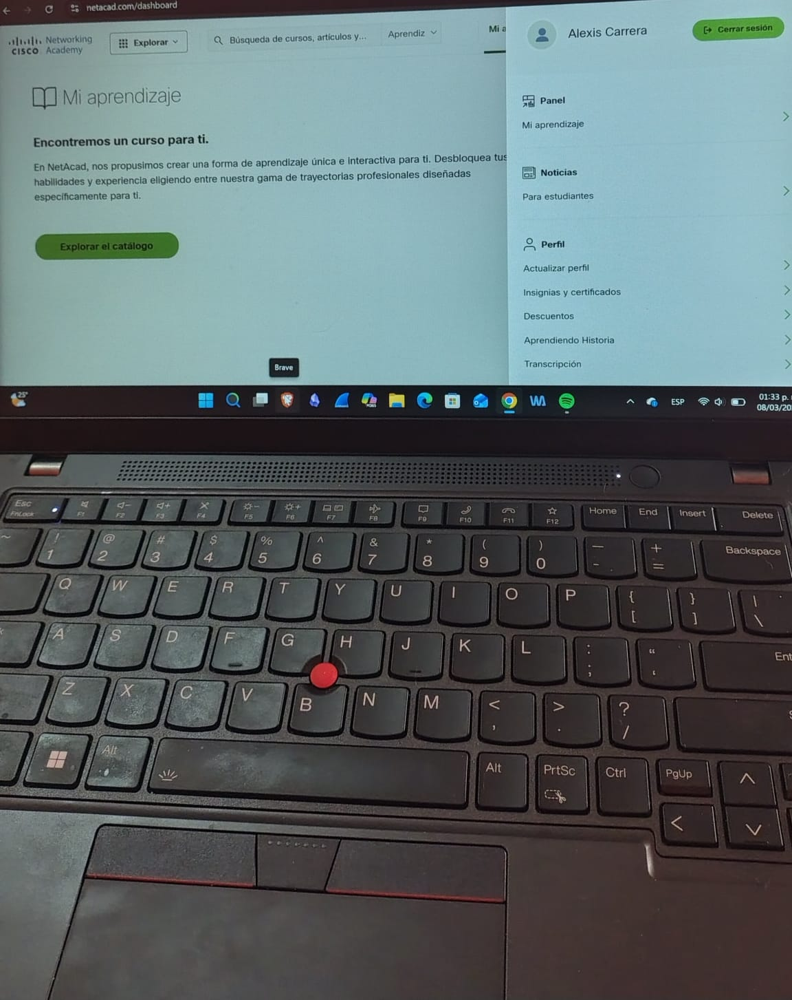

# 🛠️ Mi Laboratorio de Ciberseguridad

 

Bienvenido a mi entorno de documentación técnica. Aquí registro la configuración de mi estación de trabajo y mis prácticas de seguridad.

### 💻 Estación de Trabajo
* **Hardware:** Lenovo ThinkPad L14 Gen 4
* **Memoria:** 16GB RAM (Optimizado para laboratorios virtuales)

### 🌐 Entornos de Prueba
* **Virtualización:** Oracle VirtualBox
* **Sistemas:** Kali Linux & Ubuntu

### 🎓 Certificaciones en Curso
* **Cisco Networking Academy:** Ruta de 5 insignias (Junior Cybersecurity Analyst)
* **Google:** Google Cybersecurity Professional Certificate (En proceso)

### 🛠️ Herramientas y Frameworks
* **Análisis de Redes:** Wireshark, Nmap (Escaneo de puertos y detección de servicios).
* **Inteligencia (OSINT):** VirusTotal, TinEye, Google Dorking (Investigación de activos digitales).
* **Gestión de Datos:** Microsoft Excel Avanzado / Power BI (Análisis de patrones de amenazas).

### 🕵️ Especialidad en Perfilación Conductual
* **Detección de Engaño:** Análisis de microexpresiones y patrones en comunicación escrita.
* **Análisis de Amenazas:** Identificación de vectores de ataque basados en comportamiento humano e IA.
* **Objetivo:** Prevenir delitos cibernéticos mediante el análisis predictivo del atacante.

---
*Documentación técnica generada en mi estación de trabajo ThinkPad L14.*
